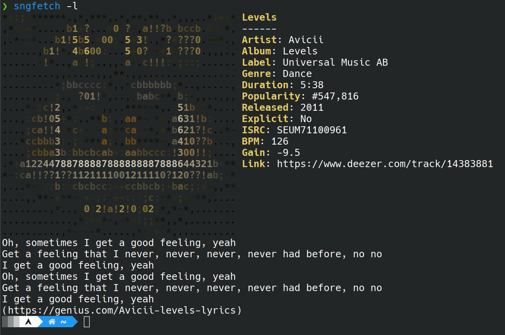

# Sngfetch 🎵
A Python application that identifies a song through your microphone and fetches detailed information about it.


## 1. About
**Sngfetch** is a Python app designed to retrieve data about a song by analyzing audio captured through your microphone.  
With Sngfetch, you can:
- Identify a song.
- Fetch song metadata (e.g., title, artist, album).
- Optionally retrieve the song lyrics.

---

## 2. How It Works
Sngfetch utilizes three APIs:
1. **Shazam API**: To identify the song and its metadata.
    > Note: The reverse engineered shazam api is accessed trough [shazamio](https://github.com/shazamio/ShazamIO).
2. **Deezer API**: To provide additional details about the song.
3. **Genius API**: (Optional) To fetch song lyrics.  
   > Note: To use the Genius API, you’ll need to [create a free account](https://docs.genius.com/) and register an application.

---

## 3. Getting Started

### Prerequisites
Make sure you have the following:
- **Python 3.7+**
    > Only if you are running the python file yourself.
- A microphone-enabled device.

### Running
1. Clone the repository:
   ```bash
   git clone https://github.com/pyth0g/Sngfetch.git
   cd Sngfetch
   ```
2. Here you can either use a packaged python binary from the **./bin** folder (windows or linux), or you can run the python file:
    ```bash
    python -m venv .venv # Create a virtual environment (not always necessary)
    source .venv/bin/activate # Only if you made a virtual environment
    pip install -r requirements.txt
    cd src
    python sngfetch.py -h # Run program and show help screen
    ```

### Packaging
If you wish to package the app yourself:
- Make sure that if you are using a virtual environment your source is in the env, then run:
    ```bash
    pip install pyinstaller
    pyinstaller sngfetch.spec # Run this in the source directory
    ```
    This will create a **dist** folder in which is your executable.

---

## 4. Usage

- Run the file with the instructions from [Running](#3-getting-started).
- These are all the possible flags:
```text
  -h, --help            show this help message and exit
  -v, --version         show program's version number and exit
  -l, --lyrics          Display the lyrics of the song fetched.
  -hi, --history        Show the history of fetched songs.
  -hic, --history-clear
                        Clear all the history of fetched songs.
  -r, --remove REMOVE   Remove a song from the history by it's title.
  -d, --duration DURATION
                        The default duration of each audio sample to be taken in seconds.
  -t, --total TOTAL     The total amount of time to listen for in seconds.
  -inc, --increase INCREASE
                        Increase the duration of each audio sample to be taken in seconds.
  -i, --infinite        Keep trying until interrupted.
  -s, --size SIZE       The size of the cover art.
  --debug               Debug mode.
  -ve, --verbosity VERBOSITY
                        Set the verbosity level of debug (will only have affect if debug is on).
  --disable-stdout      Disable stdout and remove it from log.
  --log                 Log all the output in sngfetch_i.log in the current directory (recommended to use in conjunction with disable-stdout).
```
---

## 5. Examples

### Result


### Lyrics


### History


### Demo Video
[](https://youtu.be/2EE6d8Sjp_g)

---

## 6. Contributing

Contributions are welcome! Here's how you can contribute:
- Fork the repository.
- Create a new branch (```git checkout -b feature/YourFeature```).
- Commit your changes (```git commit -m 'Add YourFeature'```).
- Push to the branch (```git push origin feature/YourFeature```).
- Open a pull request.

---

## 7. License

Distributed under the MIT License. See [LICENSE.txt](./LICENSE.txt) for more information.

---

## 8. Contact

For any questions or issues, please open an issue on the [GitHub repository](https://github.com/pyth0g/Sngfetch/issues).  
I will try to get back to you as soon as possible.